# Automaton Animator - Backend Engine


This repository contains the backend service for the Automaton Animator project. It is a robust, production-quality engine for converting regular expressions into their equivalent Nondeterministic Finite Automata (NFA).

The engine is built on a foundation of clean architecture, strict validation, and comprehensive automated testing to ensure correctness and stability.

---

## 🏛️ Core Architecture

The backend is a decoupled, stateless REST API built with Flask. Its sole responsibility is to execute automata-related logic and serve the results in a JSON format. This design adheres to the **Separation of Concerns** principle:

*   `app.py` **(Web Layer)**: Manages HTTP protocols, request/response cycles, and JSON serialization.
*   `automata_logic.py` **(Logic Layer)**: Implements the core conversion algorithms, completely independent of the web layer.

```mermaid
graph TD
    subgraph "Server Machine"
        B["🌐 Web Layer<br>(app.py / Flask)"]
        C["🧠 Logic Layer<br>(automata_logic.py)"]
    end

    A["👩‍💻 API Client"] -- "1. HTTP POST Request" --> B
    B -- "2. Internal Function Call" --> C
    C -- "3. Returns NFA Data Structure" --> B
    B -- "4. HTTP JSON Response" --> A
```



## ✨ Features

*   **Regex to NFA Conversion**: Implements Thompson's Construction algorithm to handle:
    *   Concatenation (`ab`)
    *   Union / Alternation (`a|b`)
    *   Kleene Star (`a*`)
    *   Precedence grouping with Parentheses (`()`)
*   **Strict Input Validation**: A two-stage processing pipeline (Tokenizer and Parser) ensures that only syntactically valid regular expressions are processed. It provides clear, specific error messages for invalid inputs.
*   **Certified Reliability**: The engine's correctness and robustness are guaranteed by a multi-layered automated testing suite:
    1.  **Unit & Integration Tests (pytest)**: Verifies the logic for all known, expected cases and protects against regressions.
    2.  **Property-Based Fuzz Testing (hypothesis)**: Stress-tests the engine with a vast range of unexpected and malformed inputs to ensure it never crashes with an unhandled exception.

---

## 🚀 Local Development Setup

### Prerequisites

*   Python 3.12+
*   `venv` module

### Installation

1.  **Clone the repository:**
    ```bash
    git clone <your-repository-url>
    cd backend
    ```

2.  **Create and activate a virtual environment:**
    ```bash
    python3 -m venv venv
    source venv/bin/activate
    ```

3.  **Install dependencies:**
    ```bash
    pip install -r requirements.txt
    ```

4.  **Run the development server:**
    ```bash
    python app.py
    ```
    The API will be available at `http://127.0.0.1:5000`.

---

## 🧪 Running the Test Suite

To run all automated tests, execute the following command from the project root:

```bash
pytest
```

---

## 📜 API Reference

### `POST /api/regex-to-nfa`

Converts a regular expression string into an NFA data structure.

**Request Headers:**
*   `Content-Type`: `application/json`

**Request Body:**
A JSON object with a single `regex` key.
```json
{
    "regex": "a(b|c)*"
}
```

**✅ 200 OK: Success Response**
Returns a JSON object representing the NFA.
```json
{
    "states": ["q0", "q1", "ext..."],
    "alphabet": ["a", "b", "c"],
    "transitions": [ ["q0", "a", "q6"], ["q6", "", "q2"], ["ext..."]  ],
    "start_state": "q0",
    "final_states": ["q1"]
}
```
*Note: An empty string `""` in a transition denotes an Epsilon (ε) transition.*

**❌ 400 Bad Request: Client Error Response**
Returns if the `regex` key is missing or the expression is syntactically invalid.
```json
{
    "error": "Mismatched parentheses: Missing ')'"
}
```